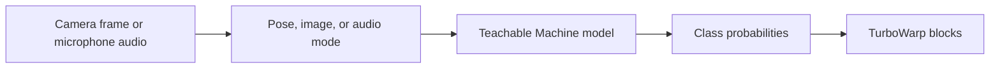

# TurboWarp TM

Use a [Teachable Machine](https://teachablemachine.withgoogle.com/) pose, image, or audio model as
an input for TurboWarp projects. The extension turns each camera frame or microphone window into labels,
confidence scores, and Boolean conditions that Scratch-style scripts can use.

TurboWarp TM uses the Scratch extension ID `kubohiroyatm` from the 2.x release line onward to
avoid short-ID collisions while the package, repository, Pages URL, and browser build use
`turbowarp-tm`.

**[Open the illustrated user guide (English)](https://kubohiroya.github.io/turbowarp-tm/)** ·
**[日本語ガイド](https://kubohiroya.github.io/turbowarp-tm/ja/)** ·
[Block reference](#blocks)

## What The Extension Does



- loads a published Teachable Machine Pose, Image, or Audio model;
- switches recognition mode between `pose`, `image`, and `audio` before input startup;
- starts and stops the camera independently from recognition;
- places a configurable camera preview over the TurboWarp stage;
- optionally overlays configurable SVG pose joints and bones on that preview in pose mode;
- reports the best label, its confidence, and the confidence of any named label;
- tests labels with a fixed or custom confidence threshold;
- optionally smooths decisions with time-decayed accumulated scores;
- reports startup timings and explicit runtime errors.

The [illustrated guide](https://kubohiroya.github.io/turbowarp-tm/) explains the complete flow,
preview layout, score behavior, privacy, and troubleshooting. English is the default; the
[Japanese version](https://kubohiroya.github.io/turbowarp-tm/ja/) has the same content.

## Requirements

- a published Teachable Machine Pose, Image, or Audio model URL;
- a camera or microphone and permission to use it in the browser;
- network access for the reviewed Teachable Machine browser runtime and the model files;
- TurboWarp's **Run without sandbox** option, which is only available when the extension is
  loaded from a file (see [Installation](#installation)).

> [!IMPORTANT]
> This is an unsandboxed extension because it needs camera, microphone, and stage access. Only load extension
> code you trust. Camera APIs also require a secure browser context such as HTTPS or localhost.

## Installation

Download [`dist/tm.js`](dist/tm.js), then in TurboWarp's custom extension dialog open the
**Files** tab, select that file, and keep **Run without sandbox** enabled.

> [!IMPORTANT]
> The dialog's **URL** tab cannot load this extension. TurboWarp always sandboxes an extension
> loaded from an untrusted URL — the URL tab has no **Run without sandbox** option at all — and TM
> refuses to start sandboxed because it needs camera, microphone, and stage access. Pasting the
> jsDelivr link below into the URL tab leaves the dialog waiting with no message on screen and only
> `TM must run without the extension sandbox.` in the browser console. Download the file and use
> the **Files** tab instead.

That download, and the artifact a composite runtime fetches, is the version-pinned build on
jsDelivr:

```text
https://cdn.jsdelivr.net/npm/@kubohiroya/turbowarp-tm@3.2.0/dist/tm.js
```

The standalone extension loads one reviewed browser runtime that contains one TensorFlow.js 4.22.0
module graph together with Teachable Machine Pose 0.8.6, Teachable Machine Image 0.8.5, and
TensorFlow.js Speech Commands 0.5.4. That runtime ships the WebGL and CPU kernels; the WebGPU and
WebAssembly backends live in separate bundles next to it and are fetched only when a project uses
them. See [Compute backends](#compute-backends).
Composite runtimes can load or embed the same artifact without rewriting a minified third-party
bundle:

```text
https://cdn.jsdelivr.net/npm/@kubohiroya/turbowarp-tm@3.2.0/dist/runtime.js
```

To add the published package to another project:

```sh
pnpm add --save-exact @kubohiroya/turbowarp-tm@3.2.0
```

### Offline PoseNet bundle API

`@kubohiroya/turbowarp-tm/posenet` owns the fixed PoseNet MobileNetV1 0.75 / stride 16
manifest, package asset specifiers, SHA-256 verification, bounded Base64 project descriptor, and
the Teachable Machine Pose fetch adapter. Host applications only decide where that explicit model
descriptor is stored. The model stays as one JSON file and two binary shards; it is never disguised
as an image, sound, or costume.

```js
import {readFile} from 'node:fs/promises';
import {
  createBundledTMRuntime,
  createPoseNetProjectBundleFromLoader,
} from '@kubohiroya/turbowarp-tm/posenet';

const projectBundle = await createPoseNetProjectBundleFromLoader((file) =>
  readFile(new URL(import.meta.resolve(file.packageSpecifier))),
);

// A browser host can store projectBundle in its own project-data channel.
// Decode and hash verification start only on the first loadFromFiles() call.
const offlineRuntime = createBundledTMRuntime({
  runtime: tmPose,
  projectBundle,
});
```

The model supply contains exactly 5,082,500 bytes. Its three SHA-256 operations run independently,
and the first shared verification overlaps the Teachable Machine classifier load. The intercepted
PoseNet fetch never exposes bytes until that verification succeeds. Later model requests reuse the
same verified supply. Tampering, missing or incorrectly sized files, and unexpected PoseNet network
requests fail closed with `TM-POSENET-*` error codes.

### Composition API

Composite runtimes can import `@kubohiroya/turbowarp-tm/composition` without registering the
Standalone extension or adding blocks. The caller supplies an already-bundled Teachable Machine
Pose runtime and validated model bytes, so this path does not download runtime scripts or model
files.

```js
import {createTMComposition} from '@kubohiroya/turbowarp-tm/composition';

const pose = createTMComposition({
  runtime: bundledTMRuntime,
  modelInitializationPolicy: 'latest-needed',
  // Optional latency-first mode; it remains off by default.
  // parallelModelInitialization: true,
});
const cameras = await pose.listCameraDevices();
if (cameras[0]) await pose.selectCamera({deviceId: cameras[0].deviceId});
const modelDemand = new AbortController();
await pose.registerPoseModel(
  {
    name: 'RescuePose',
    files: [
      {path: 'model.json', bytes: modelBytes},
      {path: 'weights.bin', bytes: weightsBytes},
      {path: 'metadata.json', bytes: metadataBytes},
    ],
  },
  {signal: modelDemand.signal},
);
pose.activatePoseModel('RescuePose');
pose.setPreviewOpacity(0.2);
pose.setPreviewPosition('full-stage');
pose.setPreviewMirroring('unmirrored');
pose.setPoseJointStyle('leftWrist', {color: '#ff00aa', opacity: 0.8, radius: 6});
pose.setPoseBoneStyle({color: '#00e5ff', opacity: 0.9, width: 3});
pose.setPoseOverlayMinimumConfidence(0.5);
pose.setPoseOverlayConfidenceScaling({
  jointOpacity: true,
  jointRadius: true,
  boneOpacity: true,
  boneWidth: true,
});
pose.configureAccumulatedPose({
  accumulationPerSecond: 1,
  decayPerSecond: 0.9,
  scoreThreshold: 0,
});
const unsubscribe = pose.subscribeAccumulatedPose((event) => {
  // event.poseName is the one currently selected candidate, or an empty string.
});
await pose.startRecognition();
```

Each composition owns its model registry, active model, camera, and recognition state. Release one
model with `releasePoseModel(name)` or release the complete instance with `releaseAll()`. Calling
`releaseAll()` also removes accumulated-pose listeners. `subscribeAccumulatedPose()` returns an
idempotent unsubscribe function.

`releasePoseModel(name)` stops recognition when the selected model is active and disposes only that
model. It does not stop the camera stream. Camera capture is an independent lifecycle: stop it with
`stopCamera()`, or release the complete composition with `releaseAll()`.

The default `modelInitializationPolicy` is `legacy`, preserving independent registration calls.
Opt in to `latest-needed` when a host has one current label-model demand, such as a story that can
skip scenes. At most one heavy runtime load is active and one latest request is pending. A newer
request cancels the active request cooperatively and replaces an older request that has not started.
For A loading, then B pending, then C requested, B never reaches the TensorFlow loader; A is cleaned
up at its next safe boundary and only C starts afterward.
Repeated `latest-needed` registrations with the same name, byte-identical files, and the same
`AbortSignal` share one pending operation instead of invoking the runtime twice. Different signals
remain separate demands so cancelling one caller cannot silently cancel another caller's work.

Pass an optional `AbortSignal` to `registerPoseModel()` when the host no longer needs that demand. A
queued request rejects with `AbortError` without invoking the runtime. TensorFlow.js 4.22.0 and Web
Crypto do not expose physical cancellation for every operation already in progress, so a running
request becomes stale immediately, starts no later phase where the runtime provides a boundary, and
disposes every late classifier/PoseNet result exactly once before its promise settles. A cancelled
model is never published in the registry. Shared fixed-PoseNet verification may finish and remain
cached when the next latest request also needs it. Model cancellation does not stop the camera.

The composition API does not infer scene or action reachability. A host should retain the signal when the same
model is needed by an imminent action, abort it when a skipped path has no nearby pose demand, or
submit the replacement model when a skip changes that demand. `releaseAll()` cancels both active and
pending registration work and waits for safe cleanup.

Runtime model phases remain sequential by default. Cancellation is checked after TensorFlow
readiness, classifier loading, metadata parsing, and PoseNet loading, so a skipped demand does not
start the next expensive phase. Set `parallelModelInitialization: true` on the composition or
`createBundledTMRuntime()` only when lower startup latency is more important than those phase
boundaries. That opt-in starts classifier, metadata, and PoseNet initialization together; work
already accepted by TensorFlow cannot be physically interrupted, but every completed stale resource
is still disposed before cancellation settles. The `latest-needed` queue continues to permit only
one active demand and one newest pending demand in either mode.

`setPreviewMirroring('mirrored' | 'unmirrored')` changes only the camera preview. It can be called
before camera startup, while the camera is running, or after it has stopped. The default remains
`mirrored`, and the recognition input keeps the Teachable Machine runtime's existing horizontal
flip regardless of the preview setting.

`setPreviewOpacity()` accepts a finite number from `0` to `1` and applies before or after camera
startup. `setPreviewPosition()` accepts `top-left`, `top-right`, `bottom-left`, `bottom-right`,
`center`, or `full-stage`. `hidePreview()` and `showPreview()` change only preview visibility; they
do not stop or restart the camera stream. Use `stopCamera()` when the MediaStream tracks must be
released.

The composition API enables its SVG pose overlay and exposes `showPoseOverlay()`,
`hidePoseOverlay()`, and `isPoseOverlayVisible()`. `setPoseJointStyle()` configures the CSS color,
opacity, and radius for any of the 17 PoseNet joint names. `setPoseBoneStyle()` configures the color,
opacity, and width shared by the 12 standard PoseNet bone connections. Opacity must be from `0` to
`1`; radii and widths must be finite and non-negative. `setPoseOverlayMinimumConfidence()` accepts
`0` through `1` and hides a bone when either endpoint is below the threshold.

`setPoseOverlayConfidenceScaling()` independently controls `jointOpacity`, `jointRadius`,
`boneOpacity`, and `boneWidth`. An enabled joint property is multiplied by that joint's confidence,
clamped to `0`–`1`. An enabled bone property is multiplied by the lower confidence of its two
endpoints. Hiding the overlay does not stop recognition. Hiding the camera preview also hides the
overlay, while stopping recognition clears every SVG mark and stopping the camera removes the SVG
element.

`listCameraDevices()` performs a fresh browser enumeration on every call. It returns a deeply
frozen canonical copy containing only unique, non-empty video device IDs in enumeration order;
labels remain the empty string when permission has not made them available. Empty IDs are omitted,
and the first occurrence wins when an ID is duplicated. Enumeration failures use
`TM-COMPOSITION-012` and never expose `MediaDeviceInfo`, `MediaStreamTrack`, or a stream.

Select `default`, `front`, or `back` as a camera preference, or wrap a session-only browser ID as
`{deviceId}`. The object form is intentionally distinct, so a physical device whose ID is literally
`default`, `front`, or `back` is not mistaken for a preference. A selection can be made before
camera startup or while recognition is running. Running switches preserve the prepared model,
recognition state, and all preview settings. Concurrent selections run in call order; a failed
switch restores the preceding successful camera and selection. Invalid selections use
`TM-COMPOSITION-011`. `getCameraSelection()` returns an isolated immutable copy, and
`getActiveCamera()` returns an immutable `{deviceId, label}` only while an identifiable camera is
running. The extension never persists device IDs. `releaseAll()` rejects queued selection work, waits for
an in-progress switch to become quiescent, and then stops the final stream; all four camera-device
methods fail closed after release.

The extension owns the camera canvas used by Teachable Machine and TensorFlow.js and requests a normal
Canvas2D context for it. Physical-camera measurements of its 320x240, one-draw/one-read path
did not show a repeatable end-to-end benefit from `willReadFrequently`; that hint improved a
different read-heavy condition with four or more reads per draw, but could make video drawing more
expensive. Chrome may therefore emit its Canvas2D readback warning during CPU inference. Preview
rendering and model input continue to use the same canvas, and no downstream Canvas prototype or
Console patch is required. Reconsider the hint only with a reproducible benchmark of this exact
camera path.

Teachable Machine Pose 0.8.6 exposes the classifier as `CustomPoseNet.model` and PoseNet as
`CustomPoseNet.posenetModel`, while its top-level `dispose()` releases PoseNet only. The composition
therefore disconnects an active model from recognition first and disposes those two public
resources separately and exactly once; it does not call the incomplete top-level disposer for this
official shape. A custom injected runtime without those fields can retain the legacy single
top-level `dispose()` contract. A runtime that exposes only part of the official shape is rejected
with `TM-COMPOSITION-009`, after every safely identifiable resource has been attempted.

Model, weights, and metadata `File` objects exist only for the pending `loadFromFiles()` call and
are not stored in the named registry. `releasePoseModel()` and `releaseAll()` invalidate and wait for
matching pending registrations, so their promises do not resolve before a late loaded model has
been disposed. Switching to an already prepared model after stopping recognition keeps the camera
stream alive; releasing the old, no-longer-active model does not request camera permission again.
Releasing the current model with no prepared successor stops recognition but keeps the camera
stream alive. `stopCamera()` and `releaseAll()` stop the stream explicitly.

The accumulated-pose API chooses one candidate for an async-input consumer. It is deliberately
separate from an Actor action that waits for multiple pose steps in sequence: a sequence consumer
should read `confidenceOf(name)` and own its per-step progress instead of using or resetting this
candidate-selection state.

Accumulated scores use elapsed wall-clock seconds, not recognition counts:

```text
nextScore = previousScore * decayPerSecond^elapsedSeconds
          + confidence * accumulationPerSecond * elapsedSeconds
```

`accumulationPerSecond` is a finite number greater than or equal to zero. `decayPerSecond` is the
finite fraction retained per second from zero through one; a changed decay takes effect in the next
recognition session. `scoreThreshold` is a finite number greater than or equal to zero. An event is
published only when the selected pose name changes, including one transition to an empty name on
reset or stop; score-only changes do not publish another event. The standalone extension enables
temporal scoring and keeps only the event feature flag off by default.

## Upgrading from 2.x

The block surface, the composition API, and the offline PoseNet bundle API are unchanged. A project
built on 2.x keeps working after swapping the extension file. New blocks appear that 2.x did not
have: three for compute backends, and six for accumulated pose scoring.

What changed is the runtime this extension bundles.

| | 2.x | 3.0.0 |
|---|---|---|
| TensorFlow.js | 1.3.1 | 4.22.0 |
| Teachable Machine Pose | 0.8.3 | 0.8.6 |
| TensorFlow.js Speech Commands | 0.4.0 | 0.5.4 |
| Compute backends | WebGL only | WebGPU, WebGL, WASM, CPU, negotiated at load |

That runtime is published as `globalThis.tf`, so a host application reading it directly moves from
the TensorFlow.js 1.x API to 4.x — the reason this is a major release. Models exported by Teachable
Machine are not affected: pose, image, and audio models exported for the 1.x-era libraries load and
run unchanged on 4.22.0.

Two behavioral notes for existing projects:

- With no `set compute mode to` block, recognition now negotiates a backend instead of always using
  WebGL. `active compute backend` reports which one won, and `last error` explains any substitution.
- The first `start camera` or `load model` downloads a larger runtime than 2.x did (1.24 MB versus
  1.04 MB), so plan the startup sequence accordingly. See [Compute backends](#compute-backends).

## Quick start

1. Train classes such as `jump`, `card`, or `clap` in Teachable Machine.
2. Export the model, upload it, and copy the model folder URL.
3. Set that URL with `set model URL to [URL]`.
4. Run `start recognition`, allow camera or microphone access, and use a result block in your script.

```text
when green flag clicked
set model URL to [https://teachablemachine.withgoogle.com/models/.../]
start recognition

forever
  if <label is [jump] with confidence at least [0.75]?> then
    ...
  end
end
```

`start recognition` starts the required input and loads the configured model when necessary. Pose and
image modes use the camera; audio mode uses the microphone. A separate `start camera` or `load model`
step is only needed when a camera project wants to control startup phases individually.

## Compute backends

Recognition runs on a TensorFlow.js compute backend. `set compute mode to [MODE]` chooses it and
`active compute backend` reports the one actually in use.

| Mode | What it does |
|---|---|
| `auto` (default) | Tries WebGPU, WebGL, WASM, and CPU in that order and keeps the first one that activates and computes a verification convolution correctly |
| `webgpu` | Modern GPU path with the lowest per-operation overhead |
| `webgl` | The long-standing GPU path, available in every browser this extension supports |
| `wasm` | SIMD WebAssembly kernels; steady on machines with weak or unreliable GPU drivers |
| `cpu` | Plain JavaScript kernels; correct everywhere and slowest |

A named mode is still only a preference. If the browser cannot provide it, the same order takes
over, `active compute backend` shows what won, and `last error` explains the substitution. That is
why a project should read `active compute backend` rather than assume the requested mode.

```text
when green flag clicked
set compute mode to [webgpu]
set model URL to [https://teachablemachine.withgoogle.com/models/.../]
start recognition
```

The reviewed browser runtime carries the WebGL and CPU kernels. The WebGPU and WebAssembly backends
are separate bundles next to `dist/runtime.js`, fetched only when a project reaches for them, and
the WebAssembly binaries come from `dist/wasm/` in this same package. Everything resolves against
the one TensorFlow.js instance the runtime published, so no page ever runs two TensorFlow.js cores.

TensorFlow.js binds every tensor to the backend that was active when the tensor was created, so the
mode has to be settled before a model loads. Changing the mode therefore releases a model that was
loaded from a URL, and the next `load model` or `start recognition` rebuilds it on the new backend.
Changing the mode during recognition, or while a host-prepared model is active, is refused instead.

Host applications reach the same negotiation through the composition API:

```js
const composition = createTMComposition({
  runtime: tmPose,
  compute: tmCompute, // published by dist/runtime.js
  computeMode: 'auto',
});

const selection = await composition.selectComputeBackend('webgpu');
// selection.backend === 'webgpu' | 'webgl' | 'wasm' | 'cpu'
// selection.fallback === true when the requested backend was unusable
```

`selectComputeBackend()` is rejected with `TM-COMPOSITION-018` while pose models are registered,
because their tensors live in the memory of the backend that loaded them. Release them first.

## Reading recognition results

| Block | Result |
|---|---|
| `current label` | Class with the highest probability in the latest frame |
| `confidence` | Current label probability, rounded to two decimal places |
| `confidence of [NAME]` | Probability of one named class |
| `label is [NAME]?` | Whether the named class has at least `0.75` confidence |
| `label is [NAME] with confidence at least [THRESHOLD]?` | Same test with a custom `0`–`1` threshold |

Live confidence reacts quickly and can fluctuate near a decision boundary. Better training data,
lighting or audio quality, camera or microphone framing, and a suitable threshold usually improve
the result.

## Camera selection, preview, and stopping

Use `refresh camera list` to detect video inputs, then choose `default camera`, `front camera`,
`back camera`, or a detected device with `set camera to [CAMERA]`. Camera labels may be unavailable
until the browser grants camera permission. Device IDs are browser- and machine-specific, so use
the portable front/back choices when a project moves between devices. Changing the selection while
the camera is running restarts only the camera stream, preserving the loaded model, recognition
state, and preview settings. If switching fails, the extension attempts to restore the previous camera and
records the error in `last error`.

`camera count` reports the latest refreshed count. `camera device ID` and `camera device name`
report the active input when the browser provides those values.

The preview is a camera canvas placed over the TurboWarp stage. It can be shown, hidden, moved to
six stage positions, made transparent, or expanded to fill the stage. Hiding the preview does not
stop recognition. The preview is mirrored by default. Use `set camera preview to [MIRRORING]` to
switch between `mirrored` and `unmirrored`, including while the camera is running. This display-only
setting does not change the frames used for recognition. The `camera preview mirroring` reporter
returns the current setting.

- `stop recognition` clears current results, stops audio listening, but leaves the camera available;
- `stop camera` also stops recognition, releases the camera tracks, and removes the preview and SVG.

The extension performs pose, image, or audio classification in the browser and does not upload
camera frames or microphone audio. It does fetch its runtime libraries and the published model. Stop
recognition and the camera when the project no longer needs them.

## Optional SVG pose overlay

The `poseOverlay` feature flag is **on by default** for the standalone TurboWarp extension, adding
blocks for overlay visibility, per-joint circle color/opacity/radius, shared bone
color/opacity/width, minimum keypoint confidence, and confidence scaling. The overlay uses a
`320 × 240` SVG coordinate system matching the camera input and follows all six preview positions
and preview mirroring. The Composition API enables this isolated overlay layer directly.

Confidence scaling can be switched independently for joint opacity, joint radius, bone opacity,
and bone width. Joint properties use the corresponding keypoint confidence; bone properties use
the smaller confidence of the connected endpoints. This makes every enabled property vary from
zero through its configured value without changing the recognition classifier input.

## Accumulated pose scoring

Live confidence flickers frame to frame near a decision boundary. The accumulated score blocks are
the built-in answer: they combine evidence over time for poses that should be held steadily, so a
brief misrecognition cannot flip a decision on its own. The `temporalPoseScoring` feature flag is
**on by default**, so these blocks are in the palette.

```text
previous × decay^elapsedSeconds + probability × accumulation × elapsedSeconds
```

The accumulation coefficient is a per-second rate. The decay coefficient is the fraction retained
after one second and is clamped to `0`–`1`; changes to decay take effect the next time recognition
starts. Accumulation and decay both pause while the document is hidden.

`accumulated pose` returns the highest positive accumulated pose only when it meets the configured
threshold, or an empty string otherwise. The accumulated score reporters continue to return their
unrounded values below that threshold. Resetting or stopping recognition clears all accumulated
scores.

### Accumulated pose change events

The `accumulatedPoseEvents` feature flag is **off by default** and requires `temporalPoseScoring`.
When both are enabled, other unsandboxed extensions can check
`runtime.ext_kubohiroyatm.supportsAccumulatedPoseEvents()` and subscribe to
`TM_ACCUMULATED_POSE_CHANGED` on the TurboWarp runtime.

Each version 2 event includes `poseName`, `previousPoseName`, `score`, `reason` (`recognition`,
`reset`, or `stop`), and a monotonic `timestamp`. Score-only updates do not emit an event.

## Troubleshooting

Read `last error` first when setup fails. Common causes are denied camera permission, a model editor
URL instead of the published model folder URL, blocked network requests, or loading the extension in
the sandbox. A sandboxed load shows nothing in the editor: the custom extension dialog simply keeps
waiting, and only the browser console carries `TM must run without the extension sandbox.` Load the
downloaded file from the dialog's **Files** tab, never from its **URL** tab.

`start camera` also needs the page to have been interacted with at least once. Browsers refuse
`video.play()` on a page with no user activation, which surfaces as `NotAllowedError: play() failed
because the user didn't interact with the document first.` Clicking the green flag counts, so an
ordinary project is fine; a packaged project that starts recognition on its own has to wait for a
button press before `start camera`. See the illustrated guide's [troubleshooting section](https://kubohiroya.github.io/turbowarp-tm/#troubleshooting)
or [Japanese troubleshooting section](https://kubohiroya.github.io/turbowarp-tm/ja/#troubleshooting)
for step-by-step checks.

## Blocks

<!-- BEGIN GENERATED BLOCKS -->

### `Teachable Machine version`

Returns the extension version.

| Property | Value |
|---|---|
| Type | REPORTER |
| Opcode | `versionReporter` |

### `set recognition mode to [MODE]`

Selects whether the current Teachable Machine model recognizes poses, images, or audio.

| Property | Value |
|---|---|
| Type | COMMAND |
| Opcode | `setRecognitionMode` |
| `MODE` | STRING, default: `pose`, menu: `recognitionModeMenu` |

### `recognition mode`

Returns the current recognition mode.

| Property | Value |
|---|---|
| Type | REPORTER |
| Opcode | `recognitionModeReporter` |

### `set compute mode to [MODE]`

Selects the TensorFlow.js compute backend. "auto" negotiates WebGPU, WebGL, WASM, and CPU in that order and falls back automatically when a backend is unusable. Changing the mode releases a model that was loaded from a URL so it can be reloaded on the new backend.

| Property | Value |
|---|---|
| Type | COMMAND |
| Opcode | `setComputeMode` |
| `MODE` | STRING, default: `auto`, menu: `computeModeMenu` |

### `compute mode`

Returns the requested compute mode.

| Property | Value |
|---|---|
| Type | REPORTER |
| Opcode | `computeModeReporter` |

### `active compute backend`

Returns the TensorFlow.js backend recognition is actually running on, which can differ from the requested mode when the browser could not provide it.

| Property | Value |
|---|---|
| Type | REPORTER |
| Opcode | `computeBackendReporter` |

### `set model URL to [URL]`

Sets the Teachable Machine model URL.

| Property | Value |
|---|---|
| Type | COMMAND |
| Opcode | `setModelURL` |
| `URL` | STRING, default: `https://teachablemachine.withgoogle.com/models/XXXX/` |

### `start camera`

Starts the camera and attaches the preview.

| Property | Value |
|---|---|
| Type | COMMAND |
| Opcode | `startCamera` |

### `stop camera`

Stops the camera and recognition loop.

| Property | Value |
|---|---|
| Type | COMMAND |
| Opcode | `stopCamera` |

### `camera is running?`

Reports whether the camera is running.

| Property | Value |
|---|---|
| Type | BOOLEAN |
| Opcode | `isCameraRunning` |

### `refresh camera list`

Refreshes the list of available video input devices.

| Property | Value |
|---|---|
| Type | COMMAND |
| Opcode | `refreshCameraList` |

### `set camera to [CAMERA]`

Selects the default, front, back, or a detected camera and switches a running camera.

| Property | Value |
|---|---|
| Type | COMMAND |
| Opcode | `setCameraSelection` |
| `CAMERA` | STRING, default: `default`, menu: `cameraMenu` |

### `camera count`

Returns the number of video input devices found by the latest refresh.

| Property | Value |
|---|---|
| Type | REPORTER |
| Opcode | `cameraCountReporter` |

### `camera device ID`

Returns the active camera device ID when available.

| Property | Value |
|---|---|
| Type | REPORTER |
| Opcode | `cameraDeviceIdReporter` |

### `camera device name`

Returns the active camera device name when available.

| Property | Value |
|---|---|
| Type | REPORTER |
| Opcode | `cameraDeviceNameReporter` |

### `show camera preview`

Shows the camera preview.

| Property | Value |
|---|---|
| Type | COMMAND |
| Opcode | `showPreview` |

### `hide camera preview`

Hides the camera preview.

| Property | Value |
|---|---|
| Type | COMMAND |
| Opcode | `hidePreview` |

### `camera preview is visible?`

Reports whether the preview is configured as visible.

| Property | Value |
|---|---|
| Type | BOOLEAN |
| Opcode | `isPreviewVisible` |

### `set camera preview opacity to [OPACITY]`

Sets preview opacity from 0 to 1.

| Property | Value |
|---|---|
| Type | COMMAND |
| Opcode | `setPreviewOpacity` |
| `OPACITY` | NUMBER, default: `0.6` |

### `set camera preview position to [POSITION]`

Sets the preview position on the stage.

| Property | Value |
|---|---|
| Type | COMMAND |
| Opcode | `setPreviewPosition` |
| `POSITION` | STRING, default: `bottom-right`, menu: `positionMenu` |

### `set camera preview to [MIRRORING]`

Sets whether the preview is mirrored without changing the recognition input.

| Property | Value |
|---|---|
| Type | COMMAND |
| Opcode | `setPreviewMirroring` |
| `MIRRORING` | STRING, default: `mirrored`, menu: `previewMirroringMenu` |

### `camera preview mirroring`

Returns mirrored or unmirrored for the current preview setting.

| Property | Value |
|---|---|
| Type | REPORTER |
| Opcode | `previewMirroringReporter` |

### `set pose overlay [VISIBILITY]`

Shows or hides the SVG pose overlay without stopping recognition.

| Property | Value |
|---|---|
| Type | COMMAND |
| Opcode | `setPoseOverlayVisibility` |
| Feature flag | `poseOverlay` |
| `VISIBILITY` | STRING, default: `on`, menu: `poseOverlayVisibilityMenu` |

### `pose overlay is visible?`

Reports whether the SVG pose overlay is configured as visible.

| Property | Value |
|---|---|
| Type | BOOLEAN |
| Opcode | `isPoseOverlayVisible` |
| Feature flag | `poseOverlay` |

### `set [PART] joint color [COLOR] opacity [OPACITY] radius [RADIUS]`

Sets the SVG circle style for one PoseNet joint.

| Property | Value |
|---|---|
| Type | COMMAND |
| Opcode | `setPoseJointStyle` |
| Feature flag | `poseOverlay` |
| `PART` | STRING, default: `nose`, menu: `poseKeypointMenu` |
| `COLOR` | STRING, default: `#00e5ff` |
| `OPACITY` | NUMBER, default: `1` |
| `RADIUS` | NUMBER, default: `4` |

### `set pose bone color [COLOR] opacity [OPACITY] width [WIDTH]`

Sets the color, opacity, and line width for all SVG pose bones.

| Property | Value |
|---|---|
| Type | COMMAND |
| Opcode | `setPoseBoneStyle` |
| Feature flag | `poseOverlay` |
| `COLOR` | STRING, default: `#00e5ff` |
| `OPACITY` | NUMBER, default: `0.9` |
| `WIDTH` | NUMBER, default: `3` |

### `set pose overlay minimum confidence to [CONFIDENCE]`

Hides joints and bones whose keypoint confidence is below the given value.

| Property | Value |
|---|---|
| Type | COMMAND |
| Opcode | `setPoseOverlayMinimumConfidence` |
| Feature flag | `poseOverlay` |
| `CONFIDENCE` | NUMBER, default: `0.5` |

### `set pose [PROPERTY] confidence scaling [STATE]`

Scales the selected SVG style property from zero to its configured value using keypoint confidence.

| Property | Value |
|---|---|
| Type | COMMAND |
| Opcode | `setPoseConfidenceScaling` |
| Feature flag | `poseOverlay` |
| `PROPERTY` | STRING, default: `joint-opacity`, menu: `poseConfidencePropertyMenu` |
| `STATE` | STRING, default: `off`, menu: `poseOverlayVisibilityMenu` |

### `load model`

Loads the configured Teachable Machine model.

| Property | Value |
|---|---|
| Type | COMMAND |
| Opcode | `loadModel` |

### `model is loaded?`

Reports whether the model is loaded.

| Property | Value |
|---|---|
| Type | BOOLEAN |
| Opcode | `isModelLoaded` |

### `start recognition`

Starts recognition.

| Property | Value |
|---|---|
| Type | COMMAND |
| Opcode | `startRecognition` |

### `stop recognition`

Stops recognition.

| Property | Value |
|---|---|
| Type | COMMAND |
| Opcode | `stopRecognition` |

### `recognition is running?`

Reports whether recognition is running.

| Property | Value |
|---|---|
| Type | BOOLEAN |
| Opcode | `isRecognizing` |

### `current label`

Returns the highest-scoring label.

| Property | Value |
|---|---|
| Type | REPORTER |
| Opcode | `currentPoseReporter` |

### `confidence`

Returns the confidence of the current label.

| Property | Value |
|---|---|
| Type | REPORTER |
| Opcode | `scoreReporter` |

### `confidence of [NAME]`

Returns the confidence for a named label.

| Property | Value |
|---|---|
| Type | REPORTER |
| Opcode | `poseScoreReporter` |
| `NAME` | STRING, default: `jump` |

### `set accumulated pose accumulation [ACCUMULATION] decay [DECAY]`

Sets the accumulation rate per second and the decay retained per second; decay changes apply to the next recognition session.

| Property | Value |
|---|---|
| Type | COMMAND |
| Opcode | `setAccumulatedPoseParameters` |
| Feature flag | `temporalPoseScoring` |
| `ACCUMULATION` | NUMBER, default: `1` |
| `DECAY` | NUMBER, default: `0.9` |

### `set accumulated pose threshold [THRESHOLD]`

Sets the minimum accumulated score required to report a pose; values below the threshold report an empty string.

| Property | Value |
|---|---|
| Type | COMMAND |
| Opcode | `setAccumulatedPoseThreshold` |
| Feature flag | `temporalPoseScoring` |
| `THRESHOLD` | NUMBER, default: `0` |

### `reset accumulated pose scores`

Clears all accumulated pose scores.

| Property | Value |
|---|---|
| Type | COMMAND |
| Opcode | `resetAccumulatedPose` |
| Feature flag | `temporalPoseScoring` |

### `accumulated pose`

Returns the pose label whose accumulated score is highest and meets the threshold, or an empty string otherwise.

| Property | Value |
|---|---|
| Type | REPORTER |
| Opcode | `accumulatedPoseReporter` |
| Feature flag | `temporalPoseScoring` |

### `accumulated score`

Returns the highest accumulated pose score without rounding.

| Property | Value |
|---|---|
| Type | REPORTER |
| Opcode | `accumulatedScoreReporter` |
| Feature flag | `temporalPoseScoring` |

### `accumulated score of [NAME]`

Returns the accumulated score for a named pose without rounding.

| Property | Value |
|---|---|
| Type | REPORTER |
| Opcode | `accumulatedPoseScoreReporter` |
| Feature flag | `temporalPoseScoring` |
| `NAME` | STRING, default: `jump` |

### `label is [NAME]?`

Reports whether the named label has at least 0.75 confidence.

| Property | Value |
|---|---|
| Type | BOOLEAN |
| Opcode | `isPose` |
| `NAME` | STRING, default: `jump` |

### `label is [NAME] with confidence at least [THRESHOLD]?`

Reports whether the named label meets the given threshold.

| Property | Value |
|---|---|
| Type | BOOLEAN |
| Opcode | `isPoseWithThreshold` |
| `NAME` | STRING, default: `jump` |
| `THRESHOLD` | NUMBER, default: `0.75` |

### `camera startup time (ms)`

Returns camera startup time in milliseconds.

| Property | Value |
|---|---|
| Type | REPORTER |
| Opcode | `cameraMsReporter` |

### `model load time (ms)`

Returns model load time in milliseconds.

| Property | Value |
|---|---|
| Type | REPORTER |
| Opcode | `modelLoadMsReporter` |

### `first recognition time (ms)`

Returns first recognition time in milliseconds.

| Property | Value |
|---|---|
| Type | REPORTER |
| Opcode | `firstRecognitionMsReporter` |

### `last error`

Returns the latest recorded error message.

| Property | Value |
|---|---|
| Type | REPORTER |
| Opcode | `lastErrorReporter` |

<!-- END GENERATED BLOCKS -->

## Development

```bash
corepack enable
pnpm install --frozen-lockfile
pnpm check
```

The check runs type checking, tests, the production build, generated-documentation validation,
Pages link validation, distribution reproducibility, and an npm package dry run. The build produces
`dist/tm.js`, `dist/composition.js`, `dist/runtime.js`, `dist/posenet.js`, and the three raw
PoseNet model assets under `dist/posenet/`.

The version in `package.json` is the release source of truth. The runtime reporter appends
`-typescript` to that version, and the release consistency check keeps the generated bundles,
exact-version README examples, Pages badges, and release tag aligned with it.

### npm publishing

npm publication uses GitHub Actions trusted publishing rather than a long-lived write token. The
npm package settings must trust `kubohiroya/turbowarp-tm`, workflow file
`publish-npm.yml`, for `npm publish`. After the annotated release tag and GitHub Release exist,
dispatch **Publish npm package** with that tag. The workflow checks out the tag, verifies that it
exactly matches `package.json`, runs the complete check, and publishes through a short-lived OIDC
credential. Roll back the automation by removing the trusted publisher in npm package settings;
do not add a write token to the repository.

## External libraries

The version-pinned `dist/runtime.js` artifact bundles TensorFlow.js 4.22.0, Teachable Machine Pose
0.8.6, Teachable Machine Image 0.8.5, TensorFlow.js Speech Commands 0.5.4, and its PoseNet 2.2.2
runtime in one reviewed module graph. The standalone extension loads that single artifact from
jsDelivr when no runtime is injected. The optional `dist/backend-wasm.js` and
`dist/backend-webgpu.js` bundles resolve TensorFlow.js against the instance that runtime already
published, so a page never ends up with two TensorFlow.js cores; the WebAssembly binaries under
`dist/wasm/` and the fixed offline PoseNet model data under `dist/posenet/` are distributed as their
original binary files.

## License

MPL-2.0
